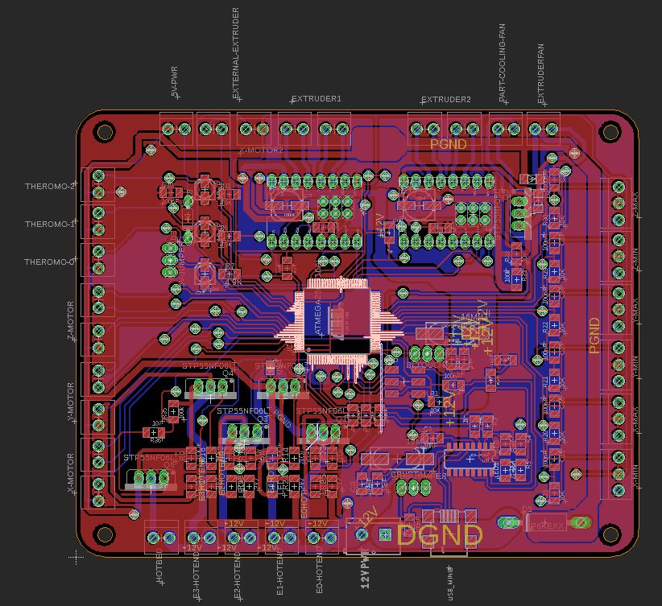

# FabRamp

Fabramp is Ramp 1.4 fabable board! its based on Atmega2560 and comes with the following features:
- 6 PWM terminals with STP55NF06L transistors that can be used for multiple Extruders/hot bed/fans
- Extruder Fan terminal
- 2 Extruders terminals with built in Polulu drivers (one of them have terminals for external driver)
- 3 Thermometer terminals with filtering capacitors
- Terminals for 3 axis motors (X, Y and Z)
- Terminals for End stops for all Axis (2 per Axis)
- BLtouch Auto level sensor terminals
- ISP headers
- USB support
- 12V Power terminals with 20A diode as reverse voltage protection
- 5V input with 5A diode as reverse voltage protect

